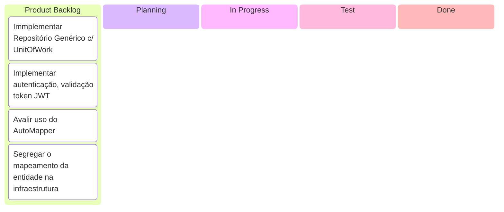

# .NET Monolito Modular - Slice Architecture

Template para projeto monolito modular em .NET utilizando Slice Architecture (Arquitetura de Fatias Verticais).

## 🏗️ Arquitetura

Este projeto implementa um **monólito modular** com as seguintes características:

- **Vertical Slices**: Cada funcionalidade é auto-contida (UI → Lógica → Dados)
- **REST/JSON**: APIs externas REST para comunicação com clientes
- **gRPC**: Comunicação interna entre slices para alta performance
- **Isolamento**: Cada slice tem seus próprios modelos, lógica e persistência
- **CQRS**: Command Query Responsibility Segregation usando MediatR
- **DDD**: Domain-Driven Design principles

## 📁 Estrutura do Projeto

```
MonolitoModular/
├── src/
│   ├── Host/                           # Ponto de entrada da aplicação
│   │   └── MonolitoModular.Host/       # Host ASP.NET Core
│   │       ├── Controllers/            # REST API Controllers
│   │       └── Program.cs              # Composition Root
│   │
│   ├── Shared/                         # Código compartilhado
│   │   ├── Contracts/                  # Interfaces e contratos
│   │   └── Infrastructure/             # Base classes e utilitários
│   │
│   └── Slices/                         # Slices verticais
│       ├── Users/                      # Slice de Usuários
│       │   └── MonolitoModular.Slices.Users/
│       │       ├── Domain/             # Entidades de domínio
│       │       ├── Infrastructure/     # DbContext, repositórios
│       │       ├── Features/           # Casos de uso (CQRS)
│       │       ├── Grpc/               # Serviços gRPC
│       │       └── UsersModule.cs      # Módulo de registro
│       │
│       └── Products/                   # Slice de Produtos
│           └── MonolitoModular.Slices.Products/
│               ├── Domain/
│               ├── Infrastructure/
│               ├── Features/
│               ├── Grpc/
│               └── ProductsModule.cs
│
├── Dockerfile
├── docker-compose.yml
└── MonolitoModular.sln
```

## 🚀 Como Executar

### Pré-requisitos

- .NET 9.0 SDK
- SQL Server (LocalDB ou Docker)
- Docker (opcional, para containerização)

### Executar Localmente

1. Clone o repositório
```bash
git clone https://github.com/elugui/dotnet-monolito-modular.git
cd dotnet-monolito-modular
```

2. Restaure os pacotes
```bash
dotnet restore
```

3. Execute o projeto
```bash
dotnet run --project src/Host/MonolitoModular.Host/MonolitoModular.Host.csproj
```

A API estará disponível em `https://localhost:5001` ou `http://localhost:5000`

### Executar com Docker

```bash
docker-compose up --build
```

A API estará disponível em `http://localhost:5000`

## 📚 Documentação da API

Após iniciar a aplicação, acesse:
- OpenAPI: `http://localhost:5033/openapi/v1.json`
- ScalarAPI: `http://localhost:5033/scalar/v1`

### Endpoints Disponíveis

#### Users
- `GET /api/users` - Listar todos os usuários
- `GET /api/users/{id}` - Obter usuário por ID
- `POST /api/users` - Criar novo usuário

#### Products
- `GET /api/products` - Listar todos os produtos
- `GET /api/products/{id}` - Obter produto por ID
- `POST /api/products` - Criar novo produto

## 🔧 Tecnologias Utilizadas

- **.NET 9.0** - Framework principal
- **ASP.NET Core** - Web API
- **Entity Framework Core 9.0** - ORM
- **MediatR** - CQRS e Mediator pattern
- **gRPC** - Comunicação interna entre slices
- **SQL Server** - Banco de dados
- **Docker** - Containerização

## 🎯 Princípios de Design

### Slice Architecture

Cada slice é organizado verticalmente contendo:

1. **Domain**: Entidades de domínio e lógica de negócio
2. **Infrastructure**: DbContext, configurações de persistência
3. **Features**: Casos de uso organizados por funcionalidade
   - Commands: Operações que modificam estado
   - Queries: Operações de leitura
4. **Grpc**: Serviços para comunicação inter-slice

### Isolamento de Slices

- Cada slice tem seu próprio **DbContext**
- Cada slice usa um **schema separado** no banco de dados
- Slices se comunicam através de **gRPC** (não referências diretas)
- Cada slice registra seus serviços através de um **Module**

### CQRS Pattern

Usando MediatR para separação de comandos e consultas:

```csharp
// Command
public record CreateUserCommand(string Name, string Email) : IRequest<Guid>;

// Query
public record GetUserQuery(Guid Id) : IRequest<User?>;
```

## 🏢 Adicionando um Novo Slice

1. Crie uma nova pasta em `src/Slices/`
2. Crie um projeto classlib:
```bash
dotnet new classlib -n MonolitoModular.Slices.NewSlice
```

3. Adicione referências aos projetos Shared
4. Implemente:
   - Domain entities
   - DbContext com schema próprio
   - Features (Commands/Queries)
   - Module para registro de serviços
   - Serviços gRPC (se necessário)

5. Registre o módulo no `Program.cs` do Host

## 🔐 Comunicação Entre Slices

Para comunicação entre slices, use **gRPC**:

### Serviços gRPC Implementados

✅ **UsersService** - Gerenciamento de usuários
- `GetUser` - Obter usuário por ID
- `GetUserByEmail` - Buscar por email
- `ValidateUser` - Validar usuário ativo
- `UserExists` - Verificar existência
- `ListUsers` - Listar com paginação

✅ **ProductsService** - Gerenciamento de produtos
- `GetProduct` - Obter produto por ID
- `CheckAvailability` - Verificar estoque
- `ReserveStock` - Reservar itens
- `ListProducts` - Listar com filtros

### Exemplo de Uso

```csharp
// No slice servidor (Users)
public class UsersGrpcService : UsersService.UsersServiceBase
{
    public override async Task<GetUserResponse> GetUser(
        GetUserRequest request, 
        ServerCallContext context)
    {
        var user = await _mediator.Send(new GetUserQuery(userId));
        return new GetUserResponse { User = MapToDto(user) };
    }
}

// No slice cliente (Products)
public class CreateProductHandler
{
    private readonly UsersService.UsersServiceClient _usersClient;

    public async Task<Guid> Handle(CreateProductCommand request)
    {
        // Validar usuário via gRPC
        var validation = await _usersClient.ValidateUserAsync(
            new ValidateUserRequest { Id = request.UserId });
        
        if (!validation.IsValid)
            throw new InvalidOperationException(validation.Reason);
        
        // Criar produto...
    }
}
```

### Documentação Completa

- 📘 [Análise e Estratégia gRPC](docs/GRPC_ANALYSIS.md)
- 📗 [Guia de Uso gRPC](docs/GRPC_USAGE_GUIDE.md)
- 📙 [Como Adicionar Serviço gRPC](docs/ADDING_GRPC_SERVICE.md)

## 📈 Benefícios desta Arquitetura

✅ **Modularidade**: Código organizado por funcionalidades de negócio
✅ **Manutenibilidade**: Fácil localizar e modificar código
✅ **Escalabilidade**: Slices podem ser extraídos para microsserviços
✅ **Testabilidade**: Cada slice pode ser testado independentemente
✅ **Performance**: gRPC para comunicação interna eficiente
✅ **Isolamento**: Mudanças em um slice não afetam outros
✅ **Deploy único**: Benefícios de um monólito com organização de microsserviços

## Lista de melhorias




## 📝 License

MIT License - veja o arquivo LICENSE para detalhes
